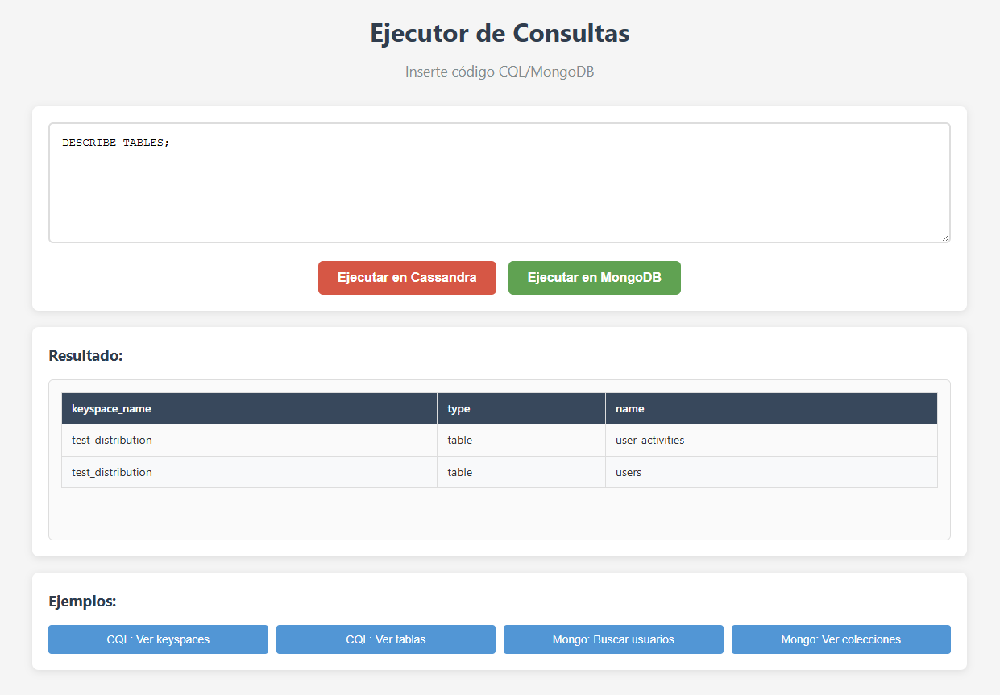

# cql-mongodb-query-app

Lightweight Node.js app to run CQL queries against Cassandra and replicate or query data in MongoDB. Includes a minimal UI for composing queries and viewing results.

## Features
- Execute CQL queries against a Cassandra cluster
- Query and insert data in MongoDB
- Simple web UI for composing and running queries
- Configurable via environment variables

## Prerequisites
- Node.js >= 14
- npm
- Running Cassandra cluster and/or MongoDB instance

## Quick Start

1. Clone repository
```bash
git clone <repo-url>
cd cql-mongodb-query-app
```

2. Install dependencies
```bash
npm install
```

3. Create a `.env` file in the project root (example below)

4. Start the app
```bash
npm start
# or for development
npm run dev
```

## Example .env
```
# Cassandra
CASSANDRA_HOST=127.0.0.1
CASSANDRA_PORT=9042
CASSANDRA_USERNAME=
CASSANDRA_PASSWORD=
CASSANDRA_KEYSPACE=your_keyspace

# MongoDB
MONGODB_URI=mongodb://localhost:27017/your_db

# App
PORT=3000
```

## Usage
- Open http://localhost:3000 in a browser
- Use the UI to enter CQL queries and run them
- Results can be viewed in the UI; exported or forwarded to MongoDB depending on configured routes

## Configuration Notes
- Provide authentication for Cassandra if required by your cluster.
- For production, use a secure secret management process rather than a plain `.env` file.
- Adjust connection timeouts and pooling in the connection modules if needed.

## Project structure (high level)
- /public - user interface logic
- server.js - main server entry point
## Troubleshooting
- Verify network access to Cassandra and MongoDB hosts/ports.
- Check logs for connection errors and authentication failures.

## Example UI


<!-- Example UI sample: client/assets/sample.png -->